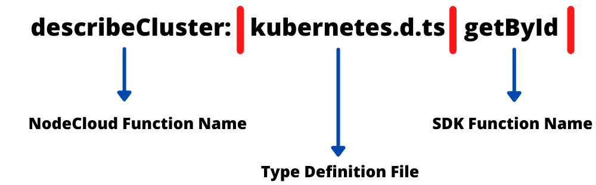
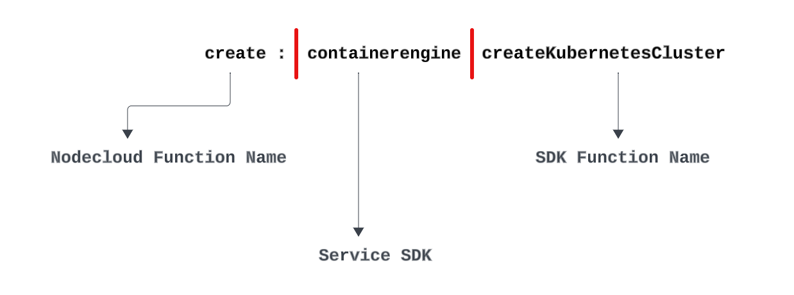
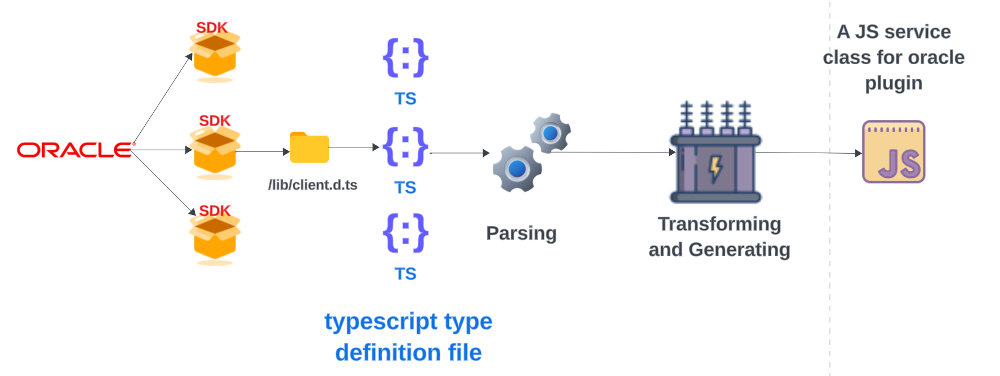
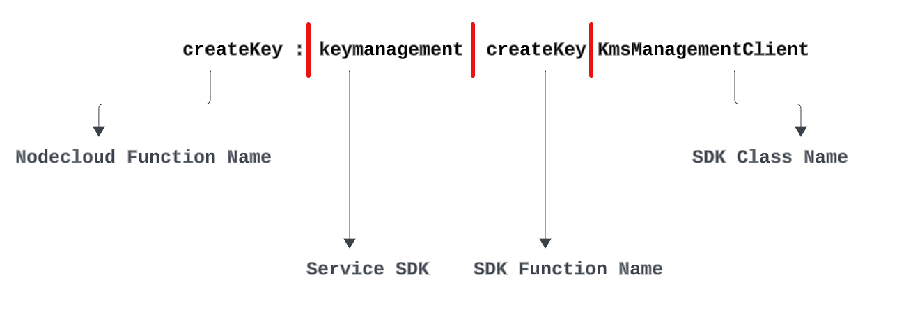
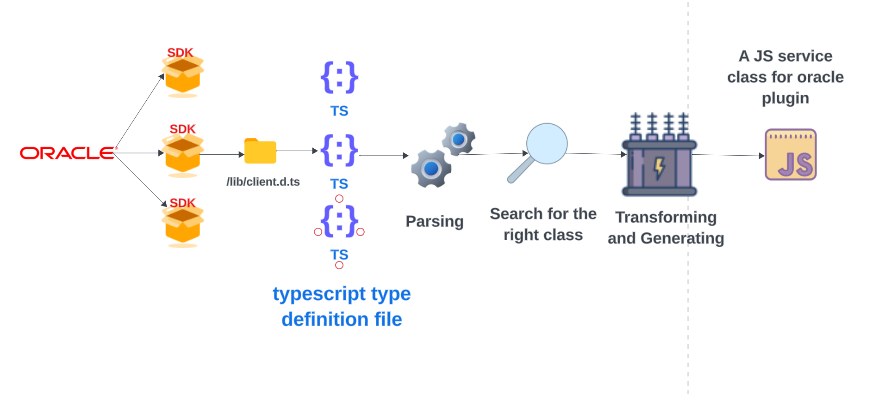
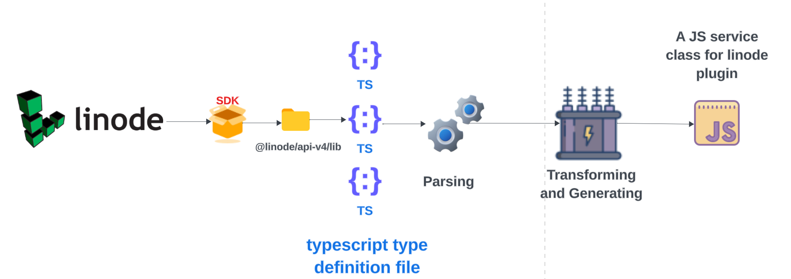
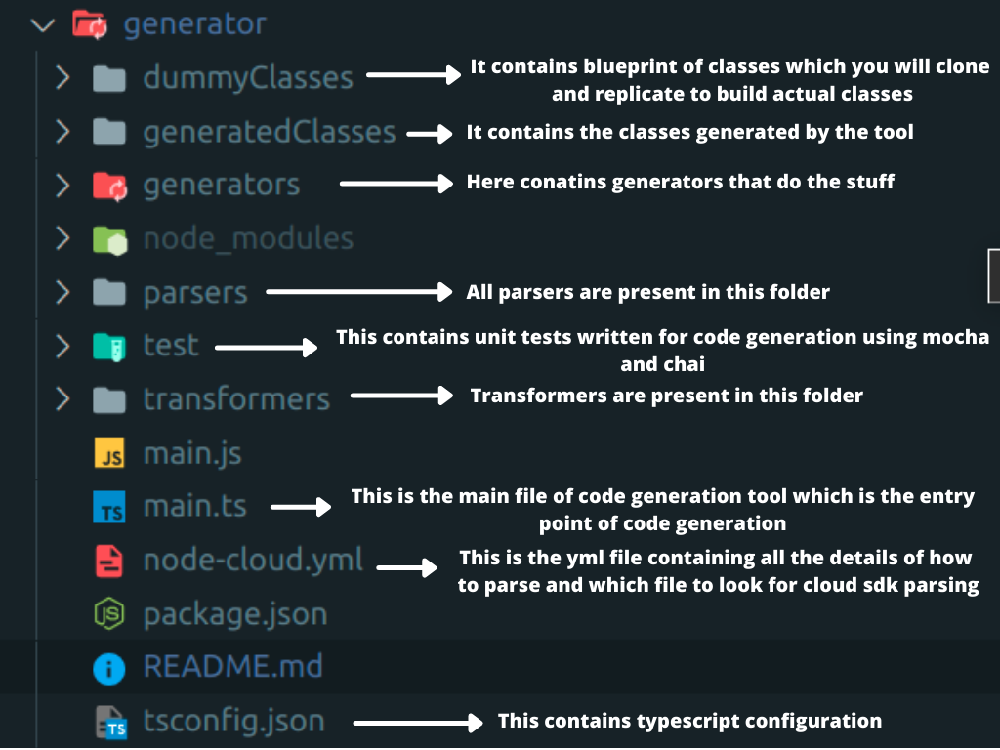
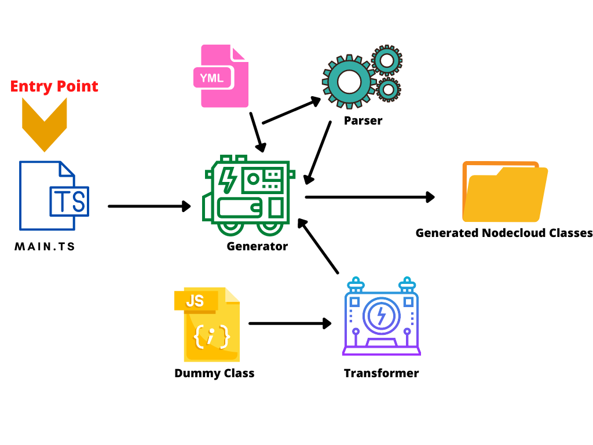

# Code Generation Tool


[](https://gitter.im/cloudlibz/cloudlibz)
[](https://medium.com/leopards-lab)
[](https://groups.google.com/g/score-community)
[](https://github.com/leopardslab/nodecloud/issues)

## Code Generation in NodeCloud

This is where new source code is generated by assembling bits and pieces. The aim of this generator is to fill the JavaScript clases in NodeCloud plugins. This code generation process is based on TypeScript compiler API. This procress can be mainly divided into three main parts,

1. Parsing the type definition files of cloud SDKs
2. Traversing through the **Abstract Syntax Tree** of the source code and collecting required data
3. Transforming a dummy **Abstract Syntax Tree** with the collected data to generate a new source code

A high level idea of the code generator can be taken from the below rich picture.


The execution of the generator starts form the `main.ts` file, where the basic information regarding the service classes are taken from the `node-cloud.yml` file and depending on the cloud provider the basic information is directed to the respective generator(e.g. - Azure generator).

## Structure of `node-cloud.yml` file

- AWS

```
AWS:
    create: elasticbeanstalk.d.ts createApplication
```

<p align="center">
  
  
</p>

- Azure

```
Azure:
    create: arm-containerservice managedClusters.d.ts createOrUpdate
```

<p align="center">
  
  
</p>

- Google Cloud (client based)

```
GCP:
   create: container v1 cluster_manager_client.d.ts createCluster
```

```
 GCP:
    getMetricData: monitoring v3 metric_service_client.d.ts getMetricDescriptor
    projectPath: monitoring v3 alert_policy_service_client.d.ts projectPath
```

`projectPath` is not an API request. Generator is capable of creating functions which gives relevant objects as well.

<p align="center">
  
  
</p>

- Google Cloud (class based)

```
GCP:
   mainClass: DNS
   createZone: dns zone.d.ts create
```

<p align="center">
  
  
</p>

For the class-based SDKs there is a minor change in the `node-cloud.yml` to record the main class of an SDK. For the above scenario, it’s the DNS class.

- Digital Ocean

```
DO:
    describeCluster: kubernetes.d.ts getById
```

<p align="center">
  
  
</p>

- Oracle 
```
Oracle:
      create: containerengine createCluster
```
<p align="center">
  
  
</p>

```
Oracle:
      createKey: keymanagement createKey KmsManagementClient
```
<p align="center">
  
  
</p>

- Linode

```
Linode:
      create: kubernetes kubernetes.d.ts createKubernetesCluster


```
<p align="center">
  
  
</p>


## Code parsers

This is the simplest part of the code generation tool. The SDK files are read from the relevant SDKs as specified in the `node-cloud.yml` file. Afterwards, it is converted to an **Abstract Syntax Tree**. Finally, the class declaration Node of that **Abstract Syntax Tree** is returned in case of SDKs which are class based,for SDKs like Linode which are function based we collect the FirstStatement nodes in an array which represent the exported arrow function declaration. This retured Node is another **Abstract Syntax Tree** since a class declaration itself is another **Abstract Syntax Tree**.


## Data extraction functions

These functions are located in the generators of the each cloud providers. Each data extration function has a unique logic depending on the **Abstract Syntax Tree** of a SDK class. The goal here is to extract all the data required to generate the new JavaScript class. At the end it is retured as `classData`. The data extration function collects imports, clients, method parameters, types of parameters, method return types and package names. Additionally, class relationships are identified in the Google Cloud data extraction function for the Google Cloud class based transformer.

## Transformers

This is the most important part of the code generator tool. Currently, there are four transformers. Two transformers for Google Cloud, and one each for AWS and Azure. All of the transformers runs three main transformations.

- `addFunctions`: In this transformation the basic structure of the code is created. Method Nodes are created to the number of functions in the `classData` object. If there are imports related to the class those statments are also added to the dummy **Abstract Syntax Tree**.

- `addIdentifiers`: In this transformation all the Identifier nodes are updated. After this transformation the code is logically compelete. All the neccessary code parts are added and finalized such as parameter names, parameter types, client names, class name, package names, SDK function names etc.

- `addComments`: This transformation aims to auto-generate the API documentation. All the comments are added to the structure required by `JSDoc`. The `@category` is used to categorize the generated classes depending on the cloud provider. This tag is from the `better-docs` template used with `JSDoc`.

## Understanding the directory structure of generator

The code generation component of nodecloud is present in generator folder. It is a separate workspace/module managed using lerna.

<p align="center">
  
</p>

## Understanding the code generator tool

The code generation tool is using typescript compiler api to extract and analyse cloud SDK's and then making the classes for nodelcloud out of it.
The tool works in this flow:

<p align="center">
  
</p>

The entry point of nodecloud is the main.ts file which you provide to typescript to generate the js file and then run the same. Inside the main file we fetch services from YML file and one by one pass the SDK file path and service name to generator function.

Inside generator we first call the parser to get the needed class and extract functions, parameters,etc needed for building Nodecloud classes. All this data is then passed onto the
transformer which transforms the dummy class into an working Nodecloud class for that specific service. All these classes are then written into the Js file.

## Running the code generation tool

- To build classes run `tsc main && node main` or 'yarn run tool' if inside generator directory and `yarn run generator` if inside nodecloud directory.
